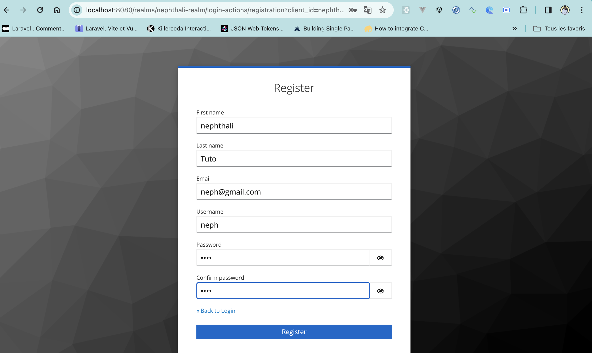
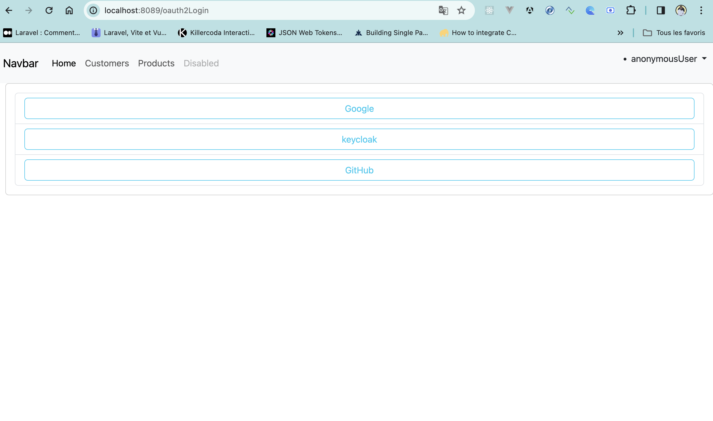
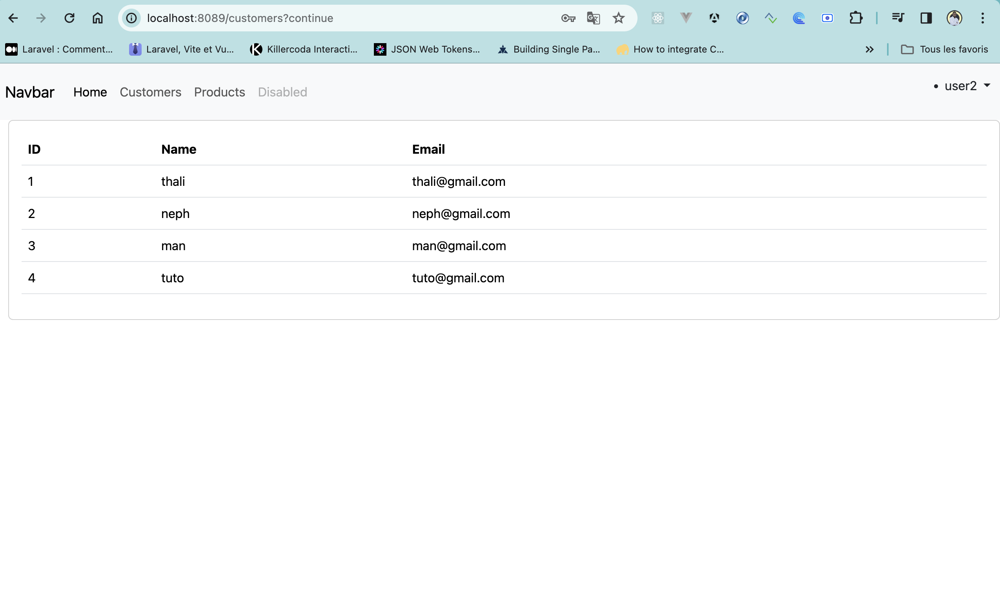

<h1>SpringBoot-thymeleaf-oauth2-oidc-keycloak-google-github</h1>

client keycloack

user rorle

role

Register

Login with keycloack

Login page

Unauthorized user

Customer page 

Products page

